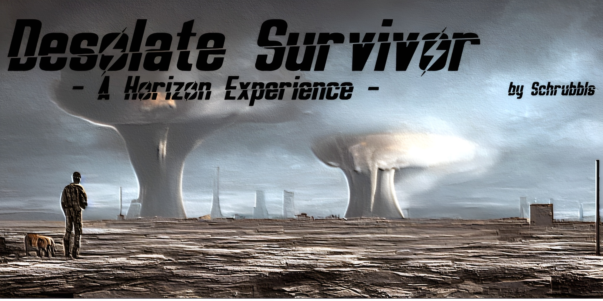

**Contains Nudity, Violence, Drug use and Gore. This means 18+ in most countries, 21+ in others. It is up to you to be sure of the age requirement in your country.**

**There is currently no Support, I work on it :)**

# What is Desolate Survivor?
It is a kinda Hardcore Fallout 4 Modlist featuring the amazing Horizon Overhaul & the Immersive Survival add-on

# Quick Links
- [What is Desolate Survivor](#what-is-desolate-survivor?)
- [Quick Links](#quick-links)
- [Before You Start](#before-you-start)
  - [Hardware Requirements](#hardware-requirements)
  - [Accounts](#accounts)
  - [DLC \& Creation Club Content](#dlc--creation-club-content)
- [Installation](#installation)
  - [Preparation](#preparation)
    - [Install Microsoft Visual C++ Redistributable Packages](#install-microsoft-visual-c-redistributable-packages)
    - [Setup your Page File](#setup-your-page-file)
    - [Setup your Shader Cache](#setup-your-shader-cache)
    - [Disable Steam Overlay](#disable-steam-overlay)
    - [Set game language to English](#set-game-language-to-english)
    - [Change Steam's Updating Behavior](#change-steams-updating-behavior)
    - [Clean current Fallout 4 installation](#clean-current-fallout-4-installation)
    - [Install Fallout 4](#install-fallout-4)
    - [Start Fallout 4](#start-fallout-4)
  - [Wabbajack](#wabbajack)
- [Post-Installation](#post-installation)
  - [Stock Game](#stock-game)
  - [Creating a desktop shortcut](#creating-a-desktop-shortcut)
- [Uninstalling Desolate Survivor](#uninstalling-desolate-survivor)
- [Helpful Stuff](#helpful-stuff)

# Before You Start
Before you dive in, there's a couple things you need to be sure of first:

## Hardware Requirements
  * CPU: Intel 7th gen *OR* AMD Ryzen 3000 series 
  * RAM: 16GB of DDR4
  * GPU: RTX 2060 *or the AMD equivalent with at least 6GB of VRAM*

You will need at least `122GB` of disk space on an SSD for the installation. For the downloads, you will need an extra around `35GB`- ideally you want *at least* `250GB` for temporary Wabbajack work space. It doesn't have to be an NVMe SSD, but a HDD of any kind will make the list painfully unplayable. 

## Accounts
In terms of accounts you will need:
  * Nexus Premium Account

## DLC & Creation Club Content
You will need *all* of the DLC for Fallout 4 ***except*** the official HD texture pack. Seriously, do not download it. 

Creation Club content is not currently supported as I am too lazy :P

# Installation
Please follow all of steps below if it is your first time installing this modlist.

## Preparation

### Install Microsoft Visual C++ Redistributable Packages
This package is a must as it is needed by MO2 - you may already have it if you've used MO2 before. If you do not have it, you want to download the x64 version under "Visual Studio 2015, 2017 and 2019".

[Download Visual C++ Redistributable Package.](https://docs.microsoft.com/en-us/cpp/windows/latest-supported-vc-redist?view=msvc-170)

### Setup your Page File
Fallout 4 modlists need a large amount of memory purely because of the amount of *stuff* in them - especially modlists on the larger side or with a lot going on. For the best experience, you should setup a pagefile of at least **20GB** - yes, even if you have a million GB of RAM. To setup your pagefile;

1. Hold down the *LEFT* Windows key and press **R**
2. Type in `systempropertiesadvanced` in the run box and then press ENTER
3. Under the "Performance" option, click the "Settings..." button
4. Switch to the "Advanced" tab
5. Under "Virtual Memory", click the "Change..." button
6. Uncheck `Automatically manage...` if it's checked
7. Select your *fastest* SSD in the list of drives
8. Check "Custom Size"
9. Set `Initial Size` to 20480
10. Set `Maximum Size` to 20480 also
    1.  *Note: you can set this up to 40000 if you have the space, this will let the pagefile expand to as large as 40GB*
11. Press the "Set" button
12. Press OK
13. Press APPLY and then OK
14. Restart your PC to apply the pagefile setting

### Setup your Shader Cache
Driver defaults from Nvidia and AMD for shader cache size is limited to 4GB. Being this small can lead to rare crashes in heavily modified Fallout 4 installs. Increasing the shader cache size is done via the Nvidia Control Panel (I assume the same for AMD users is true also but I don't have AMD hardware to check with). 

*These instructions are Nvidia specific as it is the hardware I have.*

1. Open the NVidia Control Panel
2. Head to `Manage 3D Settings`
3. Scroll down in `Global Settings` to find the `Shader Cache Size` option
4. Set the Shader Cache to *at least* 10GB
5. Done

### Disable Steam Overlay
The Steam overlay is known to cause issues when using ENBs. I recommend you turn it off to be sure that it doesn't interfere in any way and you can do so by heading into Steam, right clicking on Fallout 4 in your game library and clicking **Properties** > **General** > **Deselect "Enable Steam Overlay while in-game"**.

### Set game language to English
Wabbajack and some/most of the modding tools out there only support English language versions of games. Setting the language to English in Steam will stop issues like Wabbajack file verification failures when installing. As with disabling the overlay, right click on Fallout 4 in your game library and click **Properties** > **Language** > **Select English**.

### Change Steam's Updating Behavior
If for some reason Bethesda decide to release an update for Fallout 4, everything will probably break. Well, not *everything* but something will definitely break until mods can be updated to suit. To stop this from happening, you need to tell Steam that you only want to update when you tell it to. You can do this by right clicking on Fallout 4 in your game library and clicking **Properties** > **Updates** > **Change Automatic Updates to "Only update this game when I launch it"**. Whilst you're in here, it's also recommended to disable Steam Cloud too.

### Clean current Fallout 4 installation
If you have not yet installed Fallout 4, you can skip this part.

1. Right click on Fallout 4 in your game library and click **Properties** > **Local Files** > **Browse**. 
2. Uninstall the game via Steam - right click on Fallout 4 in your game library and click **Manage** > **Uninstall**.
3. Check the explorer window for any left over files - if there are any, delete them.
4. Open Windows start menu/search and type in `%LOCALAPPDATA%`.
5. Delete the Fallout 4 folder.
6. Head to `Documents\My Games` and delete the Fallout 4 folder.

### Install Fallout 4
Once you've done the steps above, you can now set Steam to download Fallout 4 again but ***do not*** install Fallout 4 to a protected folder, such as `Desktop`, `Downloads` or `Program Files` of any kind. It's best to create a new, dedicated folder for it using the Steam Library function somewhere on the root of your drive such as `C:\SteamLibrary`. A lot of people have a dedicated secondary drive for their games, keeping the OS install separate; using this secondary drive will also work.

### Start Fallout 4
That's right - start the game. You need to let the game do its initial start up jobs such as creating registry entries and generating default config files. Once you've gotten to the main menu you can close the game again.

## Wabbajack
Installing the list is straight forward, Wabbajack will do most of the heavy lifting for you - you only have to tell it where to put stuff.  

Set the installation location to a folder on the root of a drive, something like `C:\[Creative folder name]`. Do not install it to one of the protected folders as mentioned earlier. The download location will have likely been filled in for you too - ensure it matches the directory you set for the installation location, or if you have multiple Fallout 4 modlists installed, use a common download folder - this will stop you from having to redownload common mods across multiple modlists. 

Before you hit **GO**, a quick tip:

*To get the best performance with Wabbajack, it is recommended that you have the install folder for Wabbajack, the modlist folder and the downloads folder on an SSD; ideally the same SSD.* After the installation is complete, you can move the downloads folder to a storage HDD or other storage medium to save space on your game installation drive. It's not recommended to allow your drive to exceed 90% of its storage space used - Windows Explorer will show a red bar under your drive if you do go over 90% so you need to be sure that you have enough space on your installation drive so that you won't exceed this 90% storage level.

Once you have everything set in Wabbajack, hit **GO** and let it do its thing. It might take a while as there is a fair bit to download and the speed of this will depend on your internet performance as well as your CPU in the later stages for hashing and unpacking the downloads.

# Post-Installation
Almost there but we're not out of the woods yet! After Wabbajack has given you the installation successful screen, you're free to close it. Navigate to the WoD installation folder and run MO2 by double-clicking `ModOrganizer.exe`.

***DO NOT UNDER ANY CIRCUMSTANCES RUN LOOT. The load order is exactly as intended out of the box and you do not need to change it.***

## Stock Game
Desolate Survivor utilises the stock game feature offered by Wabbajack, meaning that Wabbajack will make a local copy of your Fallout 4 game files during the installation process. This means that your Steam installation of Fallout 4 is completely untouched, even by files that go in the game folder such as ENB files.

Enjoy suffering a little xoxo Schrubbls

# Uninstalling Desolate Survivor
Just delete your install folder. Thats it. 

# Helpful Stuff
- [Horizon Wiki](https://fo4horizon.fandom.com/wiki/Horizon_Wiki)
- [Horizon Discord Server](https://discord.gg/gW2xdaH)
- [Nexus Page Horizon v1.8 Immersive Survival System](https://www.nexusmods.com/fallout4/mods/61998/?tab=articles&topic_id=12372738)
- [Jolly Co-Operators Discord](https://discord.gg/jolly-coop)

# Thanks
- Awesome Humanbean and Fren [IAmMe](https://github.com/iAmMe27/WoD) check out his List. 
